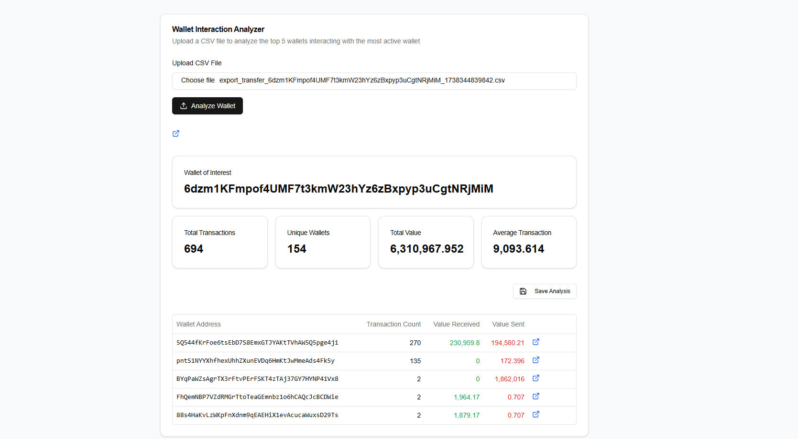

# Solana Wallet Interaction Analyzer

A Next.js application that analyzes CSV files containing Solana wallet transactions to identify and visualize key interaction patterns. The analyzer identifies the most active wallet and its top 5 interacting wallets, along with detailed transaction metrics.



## Features

- 📊 Automatic identification of the most active wallet (wallet of interest)
- 💰 Detailed transaction analysis showing:
  - Total number of transactions
  - Unique wallets interacted with
  - Total transaction value
  - Average transaction value
- 🔍 Top 5 interacting wallets analysis with:
  - Transaction count per wallet
  - Value received from each wallet
  - Value sent to each wallet
- 🔗 Direct links to Solscan.io for detailed wallet exploration
- 💾 Save analysis results for future reference
- 📱 Responsive design that works on desktop and mobile

## Tech Stack

- [Next.js 14](https://nextjs.org/) - React Framework
- [Shadcn/UI](https://ui.shadcn.com/) - UI Components
- [Tailwind CSS](https://tailwindcss.com/) - Styling
- [CSV Parse](https://csv.js.org/parse/) - CSV Processing
- [TypeScript](https://www.typescriptlang.org/) - Type Safety

## Getting Started

### Prerequisites

- Node.js 18+ 
- npm or yarn

### Installation

1. Clone the repository:
```bash
git clone https://github.com/yourusername/solana-wallet-analyzer.git
cd solana-wallet-analyzer
```

2. Install dependencies:


```shellscript
npm install
# or
yarn install
```

3. Start the development server:


```shellscript
npm run dev
# or
yarn dev
```

4. Open [http://localhost:3000](http://localhost:3000) in your browser


### CSV File Format

The analyzer expects CSV files with the following columns:

- `Signature`: Transaction signature
- `Time`: Transaction timestamp
- `Action`: Transaction type
- `From`: Source wallet address
- `To`: Destination wallet address
- `Amount`: Transaction amount
- `Flow`: Transaction direction
- `Value`: Transaction value
- `Decimals`: Token decimals
- `TokenAddress`: Token contract address


Example:

```csv

  0123456789
  SignatureTimeActionFromToAmountFlowValueDecimalsTokenAddress2wGu2zxSQofa13rd...1712774900TRANSFER5Q544fKrFoe6ts...A5L4h7nN5NHH7q...6217979666381419in-196NF4qtCm2oStKYs...


```

## Usage

1. Upload your CSV file using the file input
2. The analyzer will automatically:

1. Identify the most active wallet
2. Calculate key metrics
3. Show top 5 interacting wallets
3. Click on the external links to view wallets on Solscan.io
4. Save analyses for future reference


## Contributing

Contributions are welcome! Please feel free to submit a Pull Request.

1. Fork the repository
2. Create your feature branch (`git checkout -b feature/AmazingFeature`)
3. Commit your changes (`git commit -m 'Add some AmazingFeature'`)
4. Push to the branch (`git push origin feature/AmazingFeature`)
5. Open a Pull Request


## License

This project is licensed under the MIT License - see the [LICENSE](LICENSE) file for details.

## Acknowledgments

- [Solscan.io](https://solscan.io/) for providing wallet transaction data
- [Shadcn/UI](https://ui.shadcn.com/) for the beautiful UI components
- The Solana community for inspiration and support